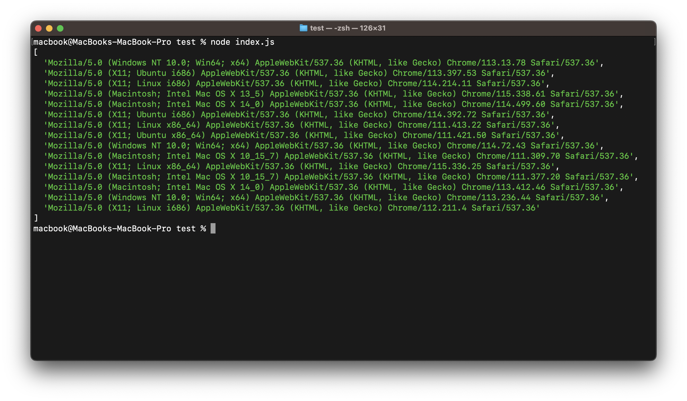

# Random User Agents

[](https://badge.fury.io/js/@rahulxf%2Frandom-user-agent)

[](https://github.com/manzil-infinity180/random-user-agent/actions/workflows/ci.yml)

## Description

Get a random user agents

## Getting Started

Installation is done using the
[`npm install` command](https://docs.npmjs.com/getting-started/installing-npm-packages-locally):

```bash
npm i @rahulxf/random-user-agent
```

```js
import { generateUserAgents } from '@rahulxf/random-user-agent';

// specify the count of user agent you want to generate (required)
const value = generateUserAgents(5);
console.log(value);
```

### Result

```bash
[
  'Mozilla/5.0 (Macintosh; Intel Mac OS X 14_0) AppleWebKit/537.36 (KHTML, like Gecko) Chrome/114.350.56 Safari/537.36',
  'Mozilla/5.0 (Macintosh; Intel Mac OS X 14_0) AppleWebKit/537.36 (KHTML, like Gecko) Chrome/112.344.67 Safari/537.36',
  'Mozilla/5.0 (X11; Linux i686) AppleWebKit/537.36 (KHTML, like Gecko) Chrome/112.259.94 Safari/537.36',
  'Mozilla/5.0 (Macintosh; Intel Mac OS X 10_15_7) AppleWebKit/537.36 (KHTML, like Gecko) Chrome/115.434.38 Safari/537.36',
  'Mozilla/5.0 (Macintosh; Intel Mac OS X 14_0) AppleWebKit/537.36 (KHTML, like Gecko) Chrome/113.123.89 Safari/537.36'
]
```

<p align="center">

</p>

---

- `getUserAgent()` method

```js
import { getUserAgent } from '@rahulxf/random-user-agent';

console.log(getUserAgent());

// 'Mozilla/5.0 (Macintosh; Intel Mac OS X 14_0) AppleWebKit/537.36 (KHTML, like Gecko) Chrome/113.123.89 Safari/537.36'

// You can also specify the count (optional)
console.log(getUserAgent(10));
```

## Contributing

To run the test suite, first install the dependencies:

```bash
git clone https://github.com/manzil-infinity180/random-user-agent.git
cd random-user-agent
npm install
```

Then run `npm test`:

```bash
npm run test
```

If you made any changes please commit the `changeset` also and then run `npm run ci` to check everything is ok
