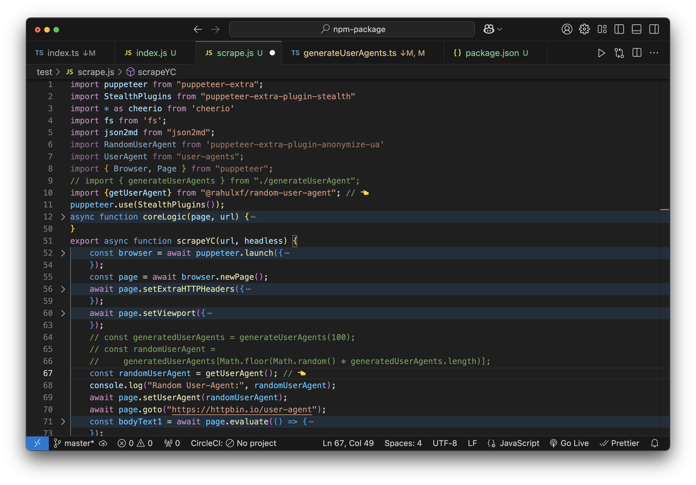

# Random User Agents

[](https://badge.fury.io/js/@rahulxf%2Frandom-user-agent)

[](https://github.com/manzil-infinity180/random-user-agent/actions/workflows/ci.yml)

### Description

A simple yet powerful NPM package to generate random user agents effortlessly. Whether you're working on web scraping, testing, or automation, this tool provides flexibility to create one or many user agents in seconds.

---

### Features

- Generate single or multiple user agents.
- Built with TypeScript for type safety and maintainability.
- Tested with Vitest and formatted with Prettier for consistent code quality.
- Fully automated CI/CD pipeline via GitHub Actions.
- Generate user agent - Chrome, Firefox, Edge, Android
- Customize Your User Agent and filter out which browser you want
- All in one Random User Agent `generateUserAgentRandom`

---

## Use this package with Puppeteer

<a href="https://www.youtube.com/watch?v=hT6DTbC0w6s">
<p align="center">

</p>
</a>

## Getting Started

Installation is done using the
[`npm install` command](https://docs.npmjs.com/getting-started/installing-npm-packages-locally):

```bash
npm i @rahulxf/random-user-agent
```

```js
import { generateUserAgents } from '@rahulxf/random-user-agent';

// Generate 5 user agents
const value = generateUserAgents(5);
console.log(value);
```

### Result

```bash
[
  'Mozilla/5.0 (Macintosh; Intel Mac OS X 14_0) AppleWebKit/537.36 (KHTML, like Gecko) Chrome/114.350.56 Safari/537.36',
  'Mozilla/5.0 (Macintosh; Intel Mac OS X 14_0) AppleWebKit/537.36 (KHTML, like Gecko) Chrome/112.344.67 Safari/537.36',
  'Mozilla/5.0 (X11; Linux i686) AppleWebKit/537.36 (KHTML, like Gecko) Chrome/112.259.94 Safari/537.36',
  'Mozilla/5.0 (Macintosh; Intel Mac OS X 10_15_7) AppleWebKit/537.36 (KHTML, like Gecko) Chrome/115.434.38 Safari/537.36',
  'Mozilla/5.0 (Macintosh; Intel Mac OS X 14_0) AppleWebKit/537.36 (KHTML, like Gecko) Chrome/113.123.89 Safari/537.36'
]
```

<p align="center">

</p>

## Other Example

- Here is implementation of each and every things

```ts
console.log({
  generateAndroidAgents: generateAndroidAgents(10),
  generateEdgeAgents: generateEdgeAgents(10),
  generateFirefoxAgents: generateFirefoxAgents(10),
  'generateUserAgentOnType:Firefox': generateUserAgentOnType({
    options: {
      type: 'firefox',
    },
  }),
  'generateUserAgentOnType:Chrome': generateUserAgentOnType({
    options: {
      type: 'chrome',
    },
  }),
  'generateUserAgentOnType:Android': generateUserAgentOnType({
    options: {
      type: 'android',
    },
  }),
  'generateUserAgentOnType:edge': generateUserAgentOnType({
    options: {
      type: 'edge',
    },
  }),
  getAndroidAgent: getAndroidAgent(),
  getEdgeAgent: getEdgeAgent(),
  getFirefoxAgent: getFirefoxAgent(),
  generateUserAgents: generateUserAgents(10),
  getUserAgent: getUserAgent(),
  generateUserAgentRandom: generateUserAgentRandom(),
});
```

Result

```bash
{
  generateAndroidAgents: [
    'Mozilla/5.0 (Linux; Android 12; moto g pure) AppleWebKit/537.36 (KHTML, like Gecko) Chrome/119.0.0.0 Mobile Safari/537.36',
    'Mozilla/5.0 (Linux; Android 12; moto g stylus 5G) AppleWebKit/537.36 (KHTML, like Gecko) Chrome/128.0.0.0 Mobile Safari/537.36',
    'Mozilla/5.0 (Linux; Android 12; moto g power (2022)) AppleWebKit/537.36 (KHTML, like Gecko) Chrome/119.0.0.0 Mobile Safari/537.36',
    ... more items
  ],

  generateEdgeAgents: [
    'Mozilla/5.0 (Macintosh; Intel Mac OS X 10_15_7) AppleWebKit/537.36 (KHTML, like Gecko) Chrome/114.457.29 Safari/537.36 Edg/114.457.29',
    'Mozilla/5.0 (X11; Ubuntu i686) AppleWebKit/537.36 (KHTML, like Gecko) Chrome/111.427.17 Safari/537.36 Edg/111.427.17',
    'Mozilla/5.0 (Windows NT 11.0; Win64; x64) AppleWebKit/537.36 (KHTML, like Gecko) Chrome/115.303.22 Safari/537.36 Edg/115.303.22',
    ... more items
  ],

  generateFirefoxAgents: [
    'Mozilla/5.0 (X11; Linux x86_64; rv:110.0) Gecko/20100101 Firefox/110.0',
    'Mozilla/5.0 (X11; Linux x86_64; rv:121.0) Gecko/20100101 Firefox/121.0',
    'Mozilla/5.0 (Windows NT 10.0; Win64; x64; rv:109.0) Gecko/20100101 Firefox/109.0',
    'Mozilla/5.0 (Windows NT 10.0; Win64; x64; rv:104.0) Gecko/20100101 Firefox/104.0',
    ... more items
  ],

  'generateUserAgentOnType:Firefox': 'Mozilla/5.0 (Windows NT 11.0; Win64; x64; rv:106.0) Gecko/20100101 Firefox/106.0',
  'generateUserAgentOnType:Chrome': 'Mozilla/5.0 (X11; Fedora i686) AppleWebKit/537.36 (KHTML, like Gecko) Chrome/113.374.92 Safari/537.36',
  'generateUserAgentOnType:Android': 'Mozilla/5.0 (Linux; Android 13; SM-A536B) AppleWebKit/537.36 (KHTML, like Gecko) Chrome/130.0.0.0 Mobile Safari/537.36',
  'generateUserAgentOnType:edge': 'Mozilla/5.0 (Windows NT 10.0; Win64; x64) AppleWebKit/537.36 (KHTML, like Gecko) Chrome/114.216.30 Safari/537.36 Edg/114.216.30',
  getAndroidAgent: 'Mozilla/5.0 (Linux; Android 13; Pixel 6 Pro) AppleWebKit/537.36 (KHTML, like Gecko) Chrome/113.0.0.0 Mobile Safari/537.36',
  getEdgeAgent: 'Mozilla/5.0 (X11; Ubuntu i686) AppleWebKit/537.36 (KHTML, like Gecko) Chrome/111.362.48 Safari/537.36 Edg/111.362.48',
  getFirefoxAgent: 'Mozilla/5.0 (X11; Linux x86_64; rv:115.0) Gecko/20100101 Firefox/115.0',

  generateUserAgents: [
    'Mozilla/5.0 (Macintosh; Intel Mac OS X 10_15_7) AppleWebKit/537.36 (KHTML, like Gecko) Chrome/112.0.52 Safari/537.36',
    'Mozilla/5.0 (Macintosh; Intel Mac OS X 13_5) AppleWebKit/537.36 (KHTML, like Gecko) Chrome/113.485.20 Safari/537.36',
    'Mozilla/5.0 (X11; Linux x86_64) AppleWebKit/537.36 (KHTML, like Gecko) Chrome/122.355.31 Safari/537.36',
    ... more items
  ],

  getUserAgent: 'Mozilla/5.0 (X11; Ubuntu i686) AppleWebKit/537.36 (KHTML, like Gecko) Chrome/124.79.79 Safari/537.36',

  generateUserAgentRandom: [
    'Mozilla/5.0 (X11; Ubuntu; Linux i686; rv:113.0) Gecko/20100101 Firefox/113.0',
    'Mozilla/5.0 (X11; Linux x86_64; rv:103.0) Gecko/20100101 Firefox/103.0',
    'Mozilla/5.0 (Macintosh; Intel Mac OS X 14.7; rv:123.0) Gecko/20100101 Firefox/123.0',
    'Mozilla/5.0 (Macintosh; Intel Mac OS X 14.7; rv:119.0) Gecko/20100101 Firefox/119.0',
    'Mozilla/5.0 (X11; Fedora; Linux x86_64; rv:130.0) Gecko/20100101 Firefox/130.0',
    'Mozilla/5.0 (Macintosh; Intel Mac OS X 10.15; rv:109.0) Gecko/20100101 Firefox/109.0',
    'Mozilla/5.0 (X11; Ubuntu; Linux x86_64; rv:120.0) Gecko/20100101 Firefox/120.0',
    'Mozilla/5.0 (Windows NT 10.0; Win64; x64; rv:130.0) Gecko/20100101 Firefox/130.0',
    ... 9992 more items
  ]
}
```

<!-- (https://github.com/user-attachments/assets/7a50a517-1600-4389-b8ab-8f9bc979f132) -->

<video width="480" height="280" controls>
  <source src="https://github.com/user-attachments/assets/7a50a517-1600-4389-b8ab-8f9bc979f132" type="video/mp4">
  Your browser does not support the video tag.
</video>

---

**Generate a single user agent:**

- `getUserAgent()` method

```js
import { getUserAgent } from '@rahulxf/random-user-agent';

console.log(getUserAgent());

// 'Mozilla/5.0 (Macintosh; Intel Mac OS X 14_0) AppleWebKit/537.36 (KHTML, like Gecko) Chrome/113.123.89 Safari/537.36'

// You can also specify the count (optional)
console.log(getUserAgent(10));
```

### Development & Contribution

If you'd like to contribute or run the project locally:

1. Clone the repository:

   ```bash
   git clone https://github.com/manzil-infinity180/random-user-agent.git
   cd random-user-agent
   npm install
   ```

2. Run tests:

   ```bash
   npm run test
   ```

3. Ensure changes meet the project's standards:
   ```bash
   npm run ci
   ```

This project uses TypeScript for development, Vitest for testing, and Prettier for formatting. All contributions are welcome!

---

### Technology Stack

- **Languages & Tools:** TypeScript, JavaScript, Node.js
- **Testing:** Vitest
- **Code Formatting:** Prettier
- **Automation:** GitHub Actions

---

### Package Details

Here's an overview of the key NPM scripts included:

| Script          | Description                                        |
| --------------- | -------------------------------------------------- |
| `build`         | Compiles TypeScript files to JavaScript.           |
| `ci`            | Runs all checks (build, format, exports, tests).   |
| `format`        | Formats code using Prettier.                       |
| `test`          | Runs tests using Vitest.                           |
| `local-release` | Handles changeset versioning and local publishing. |

---

### License

This project is licensed under the **MIT License**, allowing developers to use, modify, and share freely.
